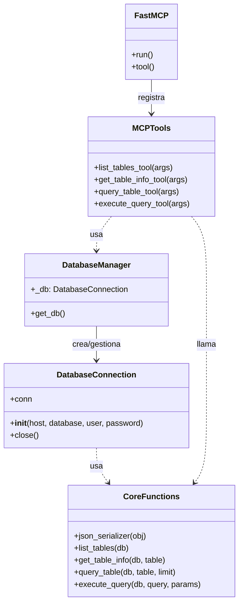
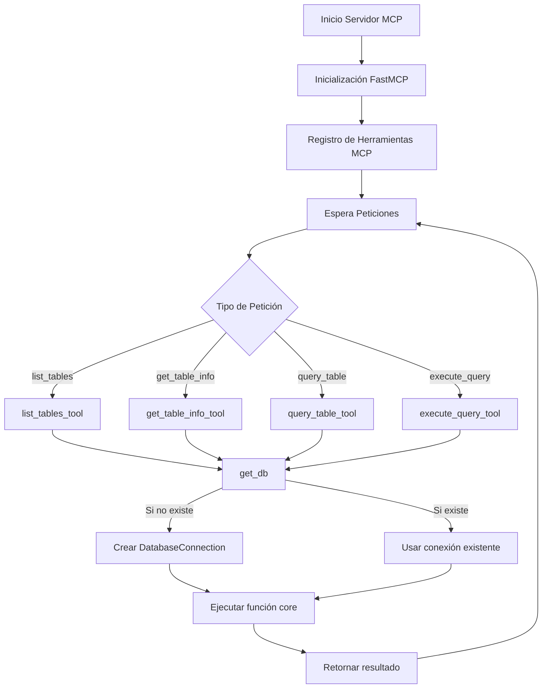

# Arquitectura del Servidor MCP PostgreSQL

## Diagrama de Clases y Componentes

## Flujo de Funcionamiento

## Componentes Principales

### 1. Gestión de Base de Datos
- `DatabaseConnection`: Clase para gestionar la conexión a PostgreSQL
  - Maneja la conexión y desconexión a la base de datos
  - Parámetros configurables: host, database, user, password
- `get_db()`: Implementación Singleton para la gestión de conexión
  - Reutiliza conexión existente si está disponible
  - Crea nueva conexión si es necesario

### 2. Funciones Core
- `json_serializer`: Serialización de tipos especiales de PostgreSQL
  - Maneja datetime, date y Decimal
- `list_tables`: Lista todas las tablas de la base de datos
  - Consulta schema_information
  - Formatea resultado
- `get_table_info`: Obtiene información detallada de una tabla
  - Estructura de columnas
  - Claves primarias
  - Conteo de registros
- `query_table`: Consulta datos de una tabla específica
  - Limitación de resultados configurable
  - Resultados en formato diccionario
- `execute_query`: Ejecuta consultas SQL personalizadas
  - Soporte para parámetros
  - Manejo de transacciones

### 3. Herramientas MCP
Cada herramienta sigue un patrón similar:
1. Obtiene conexión vía `get_db()`
2. Valida parámetros de entrada
3. Llama a función core correspondiente
4. Maneja errores y retorna resultados

- `list_tables_tool`: Interfaz para listar tablas
- `get_table_info_tool`: Interfaz para obtener información de tabla
- `query_table_tool`: Interfaz para consultar datos
- `execute_query_tool`: Interfaz para consultas SQL personalizadas

### 4. Manejo de Errores
- Try/Except en cada operación
- Rollback automático en consultas fallidas
- Cierre de conexiones garantizado
- Mensajes de error descriptivos

## Flujo de Datos

1. **Inicio de Petición**
   - Cliente hace petición a una herramienta MCP
   - Se validan los parámetros de entrada

2. **Gestión de Conexión**
   - Herramienta obtiene conexión vía `get_db()`
   - Se reutiliza conexión existente o se crea nueva

3. **Ejecución**
   - Llama a función core correspondiente
   - Función core ejecuta operación en base de datos

4. **Respuesta**
   - Resultado se formatea según el tipo de operación
   - Se devuelve al cliente en formato legible

5. **Limpieza**
   - Se manejan errores si ocurren
   - Se hace rollback si es necesario
   - Conexiones se mantienen para reutilización